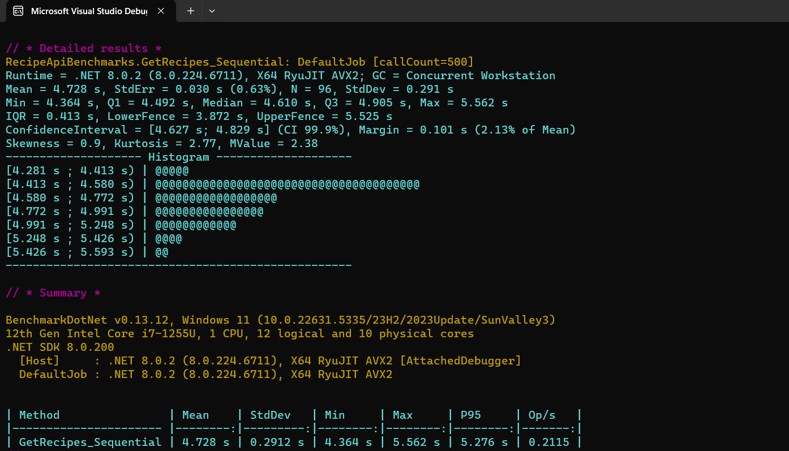

# RecipeShare App 🍳

A modern, full-stack recipe sharing application built with .NET 8 and Angular 17. Share, discover, and manage your favorite recipes with advanced filtering and search capabilities.

## ✨ Features

### 🎯 Core Functionality

- **Recipe Management**: Create, edit, delete, and view recipes
- **Advanced Search**: Search by title, description, ingredients, and more
- **Smart Filtering**: Filter by dietary tags, difficulty level, cooking time, and quick recipes
- **Real-time Updates**: Instant cache invalidation for fresh data
- **Responsive Design**: Works seamlessly on desktop and mobile devices

### 🎨 User Experience

- **Modern UI**: Clean, elegant Material Design interface
- **Loading States**: Smooth loading indicators and error handling
- **Validation**: Comprehensive form validation with helpful error messages
- **Pagination**: Efficient data loading with configurable page sizes

### 🚀 Technical Excellence

- **Performance**: Optimized caching with EasyCaching and database indexes
- **Scalability**: Microservices-ready architecture
- **Testing**: Comprehensive unit and integration tests
- **CI/CD**: Automated testing and deployment pipeline
- **Containerization**: Full Docker support with health monitoring

## 🏗️ Architecture

```ini
┌─────────────────┐    ┌─────────────────┐    ┌─────────────────┐
│   Angular 17    │    │   .NET 8 API    │    │   SQL Server    │
│   Frontend      │◄──►│   Backend       │◄──►│   Database      │
└─────────────────┘    └─────────────────┘    └─────────────────┘
         │                       │                       │
         │              ┌─────────────────┐              │
         └──────────────►│   EasyCaching   │◄─────────────┘
                        │   In-Memory     │
                        └─────────────────┘
```

## 🛠️ Tech Stack

### Frontend

- **Angular 17** - Modern frontend framework
- **Angular Material** - UI component library
- **TypeScript** - Type-safe JavaScript
- **RxJS** - Reactive programming

### Backend

- **.NET 8** - Latest .NET framework
- **Entity Framework Core** - ORM for database operations
- **ASP.NET Core Web API** - RESTful API framework
- **AutoMapper** - Object mapping
- **FluentValidation** - Input validation
- **EasyCaching** - In-memory caching solution

### Database & Caching

- **SQL Server** - Primary database
- **EasyCaching** - In-memory caching with 2-minute TTL
- **Entity Framework Migrations** - Database versioning

### DevOps & Deployment

- **Docker** - Containerization
- **Docker Compose** - Multi-container orchestration
- **GitHub Actions** - CI/CD pipeline
- **Health Checks** - Application monitoring endpoints

## 🚀 Quick Start

### Prerequisites

- .NET 8 SDK
- Node.js 18+
- Docker & Docker Compose
- SQL Server (or use Docker)

### Option 1: Docker Compose (Recommended)

1. **Clone the repository**

```bash
git clone https://github.com/Nodumo-C-khoza/RecipeShare-app.git
cd RecipeShare-app
```

2. **Build and publish the application locally**

```bash
# Build and publish the .NET application
dotnet publish RecipeShare/RecipeShare.csproj -c Release -o ./publish
```

3. **Start the application with Docker**

```bash
# Start all services (database and API)
docker-compose up -d
```

4. **Access the application**

   - **API**: http://localhost:5229/api
   - **Swagger UI**: http://localhost:5229/swagger/index.html
   - **Database**: localhost:1433

### Option 2: Local Development

1. **Backend Setup**

```bash
cd RecipeShare
dotnet restore
dotnet ef database update
dotnet run
```

2. **Frontend Setup**

```bash
cd RecipeShareAngularApp
npm install
npm start
```

3. **Access the application**

   - Frontend: http://localhost:4200
   - API: http://localhost:5229/api

## 🐳 Docker Operations

### Starting Services

```bash
# Start all services
docker-compose up -d

# View running containers
docker-compose ps

# View logs
docker-compose logs app
docker-compose logs db
```

### Stopping Services

```bash
# Stop all services
docker-compose down

# Stop and remove volumes (database data)
docker-compose down -v
```

### Rebuilding

```bash
# Rebuild and restart
docker-compose up --build -d

# Force rebuild without cache
docker-compose build --no-cache
```

## 🏥 Health Checks

The application includes comprehensive health monitoring endpoints:

### Test Health Checks

```bash
# Basic health check
curl http://localhost:5229/api/health

# Readiness check (database connectivity)
curl http://localhost:5229/api/health/ready

# Liveness check (application status)
curl http://localhost:5229/api/health/live
```

### Expected Responses

**Basic Health Check:**

```json
{
  "status": "Healthy",
  "timestamp": "2025-06-10T09:49:33.4782872Z",
  "version": "1.0.0",
  "environment": "Production"
}
```

**Readiness Check:**

```json
{
  "status": "Ready",
  "timestamp": "2025-06-10T09:49:55.4079103Z"
}
```

**Liveness Check:**

```json
{
  "status": "Alive",
  "timestamp": "2025-06-10T09:50:15.4012467Z"
}
```

### Health Check URLs

- **Health**: http://localhost:5229/api/health
- **Readiness**: http://localhost:5229/api/health/ready
- **Liveness**: http://localhost:5229/api/health/live

## 🧪 Testing

### Backend Tests

```bash
# Run all tests from the root directory
dotnet test

# Run specific test project
dotnet test RecipeShareTests/

# Run tests with coverage
dotnet test --collect:"XPlat Code Coverage"
```

### Docker Health Testing

```bash
# Test all health endpoints
curl http://localhost:5229/api/health
curl http://localhost:5229/api/health/ready
curl http://localhost:5229/api/health/live

# Test API endpoints
curl http://localhost:5229/api/recipes
curl http://localhost:5229/swagger/index.html
```

## ⏱️ Performance Benchmarks

As per the requirements, here are the benchmark results for 500 sequential calls to `GET /api/recipes` in Release mode against the database.

### BenchmarkDotNet Summary

The following table summarizes the performance observed using BenchmarkDotNet:

```md
BenchmarkDotNet v0.13.12, Windows 11 (10.0.22631.5335/23H2/2023Update/SunValley3)
12th Gen Intel Core i7-1255U, 1 CPU, 12 logical and 10 physical cores
.NET SDK 8.0.200
  [Host]     : .NET 8.0.2 (8.0.224.6711), X64 RyuJIT AVX2 [AttachedDebugger]
  DefaultJob : .NET 8.0.2 (8.0.224.6711), X64 RyuJIT AVX2
| Method                | Mean    | StdDev   | Min     | Max     | P95     | Op/s   |
|---------------------- |--------:|---------:|--------:|--------:|--------:|-------:|\
| GetRecipes_Sequential | 4.728 s | 0.2912 s | 4.364 s | 5.562 s | 5.276 s | 0.2115 |
```

### Detailed Results Screenshot



## 🔧 Configuration

### Environment Variables

- `ASPNETCORE_ENVIRONMENT` - Application environment (Production/Development)
- `ConnectionStrings__DefaultConnection` - Database connection string
- `DOTNET_RUNNING_IN_CONTAINER` - Container runtime flag

### API Configuration

The API supports the following endpoints:

- `GET /api/recipes` - Get paginated recipes with filtering
- `GET /api/recipes/{id}` - Get recipe by ID
- `POST /api/recipes` - Create new recipe
- `PUT /api/recipes/{id}` - Update recipe
- `DELETE /api/recipes/{id}` - Delete recipe
- `GET /api/health` - Health check
- `GET /api/health/ready` - Readiness check
- `GET /api/health/live` - Liveness check

## 📊 Performance Features

- **Caching**: EasyCaching in-memory cache with 2-minute TTL
- **Database Indexing**: Optimized queries with performance indexes
- **Pagination**: Efficient data loading
- **Compression**: Gzip compression for static assets
- **Rate Limiting**: API rate limiting for security

## 🔒 Security

- **Input Validation**: Comprehensive server-side validation
- **SQL Injection Protection**: Parameterized queries with EF Core
- **XSS Protection**: Security headers and input sanitization
- **Rate Limiting**: API protection against abuse
- **HTTPS Ready**: SSL/TLS configuration support

## 🚀 Deployment Options

### Azure Deployment

1. Create an Azure App Service
2. Configure connection strings
3. Deploy using GitHub Actions or Azure CLI

### AWS Deployment

1. Use AWS ECS or EKS
2. Configure RDS for database
3. Use ElastiCache for Redis (optional upgrade)

### Local Production

1. Use docker-compose
2. Configure SSL certificates
3. Set up monitoring and logging

**Estimated Monthly Costs (South Africa):**

- **Azure App Service**: R250-1,400/month
- **SQL Database**: R100-600/month
- **EasyCaching**: R0 (in-memory)
- **Storage**: R0.40/GB
- **Bandwidth**: R1.60/GB

## 🤝 Contributing

1. Fork the repository
2. Create a feature branch
3. Make your changes
4. Add tests
5. Submit a pull request

## 📝 License

This project is licensed under the MIT License - see the [LICENSE](LICENSE) file for details.

## 🙏 Acknowledgments

- Built with ❤️ using modern web technologies
- Inspired by the need for better recipe management
- Thanks to the open-source community for amazing tools

---

**Happy Cooking! 🍳✨**
